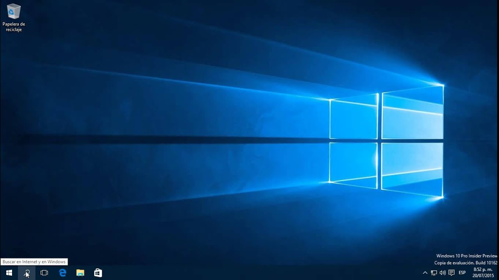
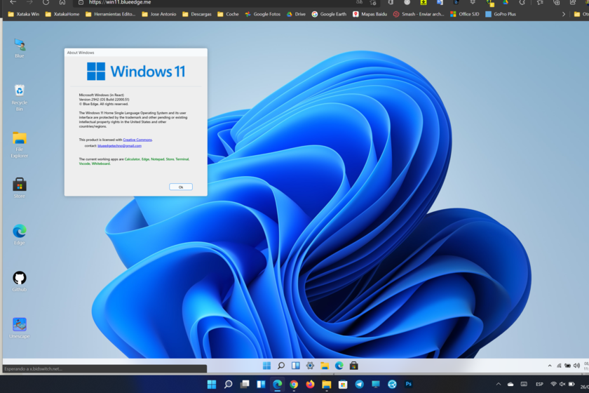

# PC-Free - Windows 10 in GitHub Codespaces | Run Windows 10 Free in Browser

Run a complete Windows 10 environment in your browser using Docker and GitHub Codespaces. Free, fast, and no installation required.

[](https://github.com/jephersonRD/pc-free/stargazers)
[](https://github.com/jephersonRD/pc-free/network/members)
[](https://opensource.org/licenses/MIT)
[](https://www.docker.com/)
[](https://www.microsoft.com/windows)

**[🇪🇸 Español](#español)** • **[🚀 Quick Start](#quick-start-run-windows-10-in-5-minutes)** • **[📖 Documentation](#documentation)** • **[🐛 Report Bug](https://github.com/jephersonRD/pc-free/issues)**



---

## What is PC-Free?

PC-Free is an open-source project that lets you run Windows 10 directly in your web browser using GitHub Codespaces and Docker. No local installation, no powerful hardware required, completely free.

### Key Benefits

- ✅ **100% Free** - No hidden costs or subscriptions
- ✅ **Browser-Based** - Access Windows from any device
- ✅ **5-Minute Setup** - Deploy Windows 10 in minutes
- ✅ **No PC Required** - Run Windows without owning a Windows PC
- ✅ **Docker Container** - Isolated, secure, and portable
- ✅ **Persistent Data** - Your files and apps survive restarts
- ✅ **Open Source** - MIT licensed, community-driven

---

## Table of Contents

- [Features](#features)
- [Use Cases](#use-cases---when-to-use-pc-free)
- [Quick Start](#quick-start-run-windows-10-in-5-minutes)
- [System Requirements](#system-requirements)
- [Installation Guide](#guía-rápida)
- [Usage Instructions](#usage-instructions)
- [Configuration Options](#configuration-options)
- [FAQ](#frequently-asked-questions-faq)
- [Troubleshooting](#troubleshooting-common-issues)
- [Contributing](#contributing)
- [License](#license)

---

## Features

### Cloud Windows Environment

Run a full Windows 10 desktop environment in your browser without downloading or installing anything locally. Perfect for developers, students, and professionals who need Windows access on Mac, Linux, or Chromebook.

### Docker-Powered Performance

Leverages Docker containers for fast deployment, isolated execution, and easy management. Your Windows environment is containerized for security and portability.

### GitHub Codespaces Integration

Deploy instantly to GitHub Codespaces with generous free tier (60 hours/month). No credit card required for basic usage.

### Complete Feature Set

- Full Windows 10 desktop experience
- Web-based VNC access (noVNC)
- RDP support for native remote desktop
- Persistent storage volumes
- Customizable RAM and CPU allocation
- Windows 10 and 11 support
- Secure, private environment

---

## Use Cases - When to Use PC-Free

| Use Case | Description | Ideal For |
|----------|-------------|-----------|
| **Remote Work** | Access Windows applications from Mac, Linux, or mobile devices | Remote workers, digital nomads |
| **Development & Testing** | Test Windows-specific applications and software | Developers, QA testers |
| **Education & Learning** | Learn Windows administration without installing locally | Students, IT learners |
| **Cross-Platform Work** | Run Windows-only software on non-Windows devices | Mac users, Linux users |
| **Secure Testing** | Test untrusted software in isolated container | Security researchers, IT admins |
| **Temporary Access** | Quick Windows access without permanent installation | Consultants, freelancers |

---

## Comparison: PC-Free vs Alternatives

Compare PC-Free with other Windows cloud solutions:

| Feature | PC-Free | Azure Virtual Desktop | AWS WorkSpaces | Local VM |
|---------|---------|----------------------|----------------|----------|
| **Monthly Cost** | ✅ $0 (Free) | ❌ $31-100+ | ❌ $25-75+ | ✅ $0 (Free) |
| **Setup Time** | ⚡ 5 minutes | ⏱️ 30+ minutes | ⏱️ 30+ minutes | ⏱️ 15-30 minutes |
| **Hardware Required** | ✅ None | ✅ None | ✅ None | ❌ Powerful PC needed |
| **Browser Access** | ✅ Yes | ✅ Yes | ✅ Yes | ⚠️ Limited |
| **Open Source** | ✅ Yes | ❌ No | ❌ No | ⚠️ Partial |
| **Data Persistence** | ✅ Yes | ✅ Yes | ✅ Yes | ✅ Yes |

---

## Quick Start: Run Windows 10 in 5 Minutes

### Method 1: One-Click GitHub Codespaces (Recommended)

The fastest way to get Windows 10 running in your browser:

1. **Fork this repository** - Click "Fork" button at top right
2. **Open Codespace** - Click "Code" → "Codespaces" → "Create codespace on main"
3. **Wait for setup** - Environment loads automatically (~2 minutes)
4. **Follow the Guía Rápida below**

### Method 2: Manual Docker Setup

For local Docker installation, see the complete guide below.

---

## Guía Rápida

### 1️⃣ Verifica el almacenamiento disponible

```bash
df -h
```

Escoge la partición con más espacio libre.

### 2️⃣ Crea la carpeta de datos para Docker

```bash
sudo mkdir -p /tmp/docker-data
```

### 3️⃣ Configura Docker

Edita el archivo:

```bash
sudo nano /etc/docker/daemon.json
```

Agrega:

```json
{
  "data-root": "/tmp/docker-data"
}
```

### 4️⃣ Reinicia tu Codespace

Para aplicar los cambios de configuración.

### 5️⃣ Verifica Docker

```bash
docker info
```

Asegúrate de que `Docker Root Dir` sea `/tmp/docker-data`.

---

## 🧱 Archivo `windows10.yml`

```yaml
# Antes de ejecutar docker-compose up, ejecuta:
# bash check_github_follow.sh || exit 1
# Si no sigues a https://github.com/jephersonRD, el entorno no se iniciará.
services:
  windows:
    image: dockurr/windows
    container_name: windows
    environment:
      VERSION: "10"
      USERNAME: ${WINDOWS_USERNAME}
      PASSWORD: ${WINDOWS_PASSWORD}
      RAM_SIZE: "10G"
      CPU_CORES: "4"
    cap_add:
      - NET_ADMIN
    ports:
      - "8006:8006"
      - "3389:3389/tcp"
    volumes:
      - /tmp/docker-data:/mnt/disco1
      - windows-data:/mnt/windows-data
    devices:
      - "/dev/kvm:/dev/kvm"
      - "/dev/net/tun:/dev/net/tun"
    stop_grace_period: 2m
    restart: always

volumes:
  windows-data:
```

---

## 🗝️ Archivo `.env`

```ini
WINDOWS_USERNAME=YourUsername
WINDOWS_PASSWORD=YourPassword
GITHUB_USER=YourGitHubUsername
```

### 🛑 Agrega este archivo a tu `.gitignore`:

```bash
echo ".env" >> .gitignore
```

---

## ▶️ Inicia el contenedor

### Iniciar por primera vez

```bash
docker-compose -f windows10.yml up
```

### 🔌 Apagar la PC

```bash
docker stop windows
```

---

## System Requirements

### For GitHub Codespaces (Recommended)

- GitHub account (free tier supported)
- Modern web browser (Chrome 90+, Firefox 88+, Edge 90+, Safari 14+)
- 10GB+ available Codespace storage
- Stable internet connection (2 Mbps+ recommended)

### For Local Docker Installation

- Docker Engine 20.10 or higher
- 20GB+ free disk space
- 8GB+ RAM (16GB recommended)
- KVM support (Linux hosts) or Hyper-V (Windows hosts)
- Operating System: Linux, macOS, or Windows 10/11 Pro

---

## Usage Instructions

### Start Windows Environment

Start the Windows container:

```bash
docker-compose -f windows10.yml up -d
```

### Stop Windows Environment

Stop the Windows container gracefully:

```bash
docker stop windows
```

### Restart Windows

Restart the container (useful after freezes):

```bash
docker restart windows
```

### View Container Logs

Monitor Windows container activity:

```bash
docker logs -f windows
```

Press Ctrl+C to exit log view.

### Complete Removal

Remove container and all data volumes:

```bash
docker-compose -f windows10.yml down -v
```

**⚠️ Warning**: This deletes all Windows data permanently.

---

## Configuration Options

### Customize System Resources

Edit `windows10.yml` to adjust resources:

```yaml
environment:
  VERSION: "10"              # Windows version (10 or 11)
  RAM_SIZE: "10G"           # RAM allocation
  CPU_CORES: "4"            # CPU core count
  DISK_SIZE: "64G"          # Virtual disk size
  USERNAME: ${WINDOWS_USERNAME}
  PASSWORD: ${WINDOWS_PASSWORD}
```

### Switch to Windows 11

Change Windows version in environment:

```yaml
environment:
  VERSION: "11"  # Windows 11
```

### Enable RDP Access

Add RDP port mapping for native Remote Desktop:

```yaml
ports:
  - "8006:8006"    # Web interface (noVNC)
  - "3389:3389"    # RDP protocol
```

Connect using RDP client: `localhost:3389`

### Adjust Performance Settings

For slower systems, reduce resource allocation:

```yaml
environment:
  RAM_SIZE: "6G"     # Minimum for Windows 10
  CPU_CORES: "2"     # Minimum cores
```

---

## Screenshots

### Windows 10 Desktop Interface


### Windows 11 Alternative


### Browser-Based Access


---

## Frequently Asked Questions (FAQ)

### How long does Windows take to boot?

- **Initial boot**: 5-10 minutes (downloading Windows image)
- **Subsequent boots**: 2-3 minutes

### Can I install additional software?

Yes! You have full administrator access. Installed software persists in Docker volumes between restarts.

### Does this work on GitHub free tier?

Yes! GitHub free tier includes 60 hours/month of Codespaces, which is sufficient for regular testing and development work.

### Can I use this for gaming?

Limited. Codespaces don't have GPU acceleration. Light, older games may work, but modern 3D games won't run well.

### Is this legal to use?

Yes, provided you have a valid Windows license. This uses official Windows installation methods. Check Microsoft's licensing terms for your use case.

### How secure is this setup?

Your Windows environment runs in an isolated Docker container within your private GitHub Codespace. Only you have access unless you share the Codespace link.

### Can I access my files from outside?

Yes, files stored in Docker volumes persist between sessions. You can also mount external volumes or use cloud storage within Windows.

### What internet speed do I need?

Minimum 2 Mbps for basic usage. 5+ Mbps recommended for smooth experience. Initial setup requires downloading ~4GB Windows image.

---

## Troubleshooting Common Issues

### Windows Container Won't Start

Check Docker logs for errors:

```bash
docker logs windows
```

Verify KVM access (Linux):

```bash
ls -la /dev/kvm
```

### Slow Performance Issues

1. Reduce RAM allocation to 6G
2. Reduce CPU cores to 2
3. Close other resource-intensive Codespace apps
4. Check Codespace resource usage

### Cannot Access Port 8006

1. Go to "Ports" tab in Codespace
2. Make port 8006 visibility "Public"
3. Click globe icon to open in browser
4. Check firewall settings if on local Docker

### Storage Full Error

Clean Docker cache and unused images:

```bash
# Remove unused Docker data
docker system prune -a

# Check available space
df -h
```

### Container Keeps Restarting

Check if KVM is available:

```bash
# Linux
ls -l /dev/kvm

# If not available, may need to enable KVM in BIOS
```

### Black Screen After Login

1. Wait 2-3 minutes for desktop to load
2. Try refreshing browser
3. Check if container is still running: `docker ps`
4. Restart container: `docker restart windows`

---

## Roadmap - Upcoming Features

- [x] Windows 10 support
- [x] Docker Compose setup
- [x] Web interface (noVNC)
- [x] Persistent storage volumes
- [x] Windows 11 support
- [ ] One-click installer script
- [ ] GPU passthrough (local Docker)
- [ ] Audio support improvement
- [ ] Clipboard synchronization
- [ ] Pre-configured Windows templates
- [ ] Multiple Windows instances
- [ ] Automated backup system
- [ ] Performance optimization guide

[Vote for features →](https://github.com/jephersonRD/pc-free/discussions)

---

## Contributing

Contributions are welcome! Help improve PC-Free:

1. **Fork** the project repository
2. **Create** feature branch: `git checkout -b feature/AmazingFeature`
3. **Commit** changes: `git commit -m 'Add AmazingFeature'`
4. **Push** to branch: `git push origin feature/AmazingFeature`
5. **Open** a Pull Request

See [CONTRIBUTING.md](CONTRIBUTING.md) for detailed guidelines.

### Ways to Contribute

- 🐛 Report bugs and issues
- 💡 Suggest new features
- 📝 Improve documentation
- 🔧 Submit bug fixes
- ⭐ Star and share the project

---

## Community & Support

- 💬 [GitHub Discussions](https://github.com/jephersonRD/pc-free/discussions) - Ask questions
- 🐛 [Issue Tracker](https://github.com/jephersonRD/pc-free/issues) - Report bugs
- ⭐ [Star this repo](https://github.com/jephersonRD/pc-free) - Show support
- 👤 Follow [@jephersonRD](https://github.com/jephersonRD) for updates

---

## Documentation

- 📖 [Full Documentation](https://github.com/jephersonRD/pc-free/wiki)
- 🚀 [Advanced Setup Guide](https://github.com/jephersonRD/pc-free/wiki/Advanced-Setup)
- 🔧 [Troubleshooting Guide](https://github.com/jephersonRD/pc-free/wiki/Troubleshooting)
- 🎯 [Best Practices](https://github.com/jephersonRD/pc-free/wiki/Best-Practices)

---

## License

Distributed under the MIT License. See [LICENSE](LICENSE) file for more information.

---

## Acknowledgments

Special thanks to:

- [dockurr/windows](https://github.com/dockurr/windows) - Docker Windows image
- [GitHub Codespaces](https://github.com/features/codespaces) - Cloud development environment
- All our [amazing contributors](https://github.com/jephersonRD/pc-free/graphs/contributors)

---

## Support the Project

If PC-Free helped you, consider:

- ⭐ **Starring** this repository
- 🐦 **Sharing** on social media
- 📝 **Writing** a blog post about it
- 🤝 **Contributing** code or documentation

---

## 🇪🇸 Español

### Inicio Rápido en Español

1. Haz fork del repositorio
2. Abre en Codespace
3. Sigue la Guía Rápida arriba
4. Accede al puerto 8006

[Ver documentación completa →](https://github.com/jephersonRD/pc-free/wiki)

---

<div align="center">

**⭐ Star this repo if you found it helpful!**

Made with ❤️ for developers who need Windows without owning a PC

[⬆ Back to top](#pc-free---windows-10-in-github-codespaces--run-windows-10-free-in-browser)

</div>
